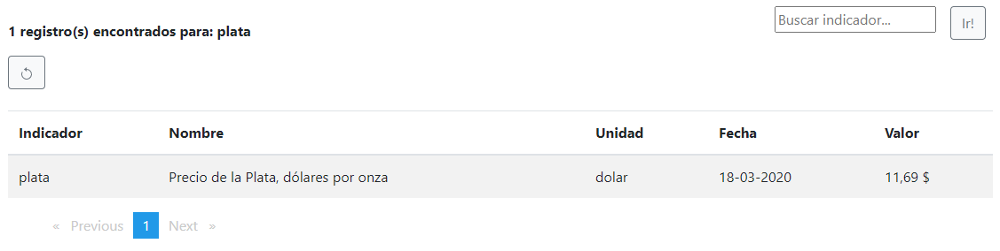

# "Test de programación - Banco Bice Lab" propuesta de enfoque técnico

**Selected stack:**
  - Angular 11 / Bootstrap 
  - API Rest .Net Core 3.1 (C#)
  - URL servicio indicadores económicos
  
# Visión General

Se solicita construir una solución Web que se pueda conectar a la URL https://www.indecon.online/ con el obetivo de obtener uno o varios indicadores económicos.

**Solución resultante:**

Fig.1

...Como se puede apreciar, en las siguientes imágenes, la solución presenta un Front End inicial para listar Indicadores (en esta caso la búsqueda desencadenó un total de 10 tipos de ítemes). Los valores de fecha en el origen se encuentran en formato Unix Time (valor númerico) transformado al valor de fecha local. Tal como se muestra en la primera imagen se despliega la lista de ítemes con una paginación de 5 líneas por lista, y por último un resultado de búsqueda específica en la figura 2 y 3 por tipo de indicador.

Fig.2

 Fig.3

Fig.4

**NOTA: los valores de indicadores no son rodonadeados, se muestran con tipo de unidad respectivo.**

- Además, se detalla búsqueda errónea para ingreso de números y símbolos.

Fig.5

# Aspectos destacados del esquema y la arquitectura de la solución técnica

- Primero tendremos tres partes principales acopladas como se mencionó al principio, implementadas y ejecutándose en una máquina local, e interactúan de acuerdo con la siguiente imagen::

Fig.6

- En segundo lugar, con respecto al componente "frontal" (aplicación Angular 11), a continuación se muestra la estructura simple de los componentes:

Fig.7

- Una API REST construida en .NET Core 3.1 tiene una arquitectura interna de N-Layer para asegurar la separación de responsabilidades y la mantenibilidad que sigue el enfoque del siguiente diagrama:

Fig.8

Fig.9

- Finalmente el resultado de un test de la API REST construida en .NET Core 3.1 MsTest tal como se aprecia en el árbol de solución.

Fig.10